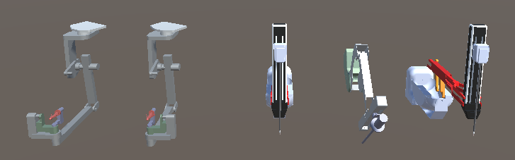

dVRK Mixed Reality Extension
====================
This repository has code related to da Vinci Research Kit Mixed Reality extension.

# Overview

Video Examples:

<table border=0>
<tr>
	<td align="center" width="50%"></td>
	<td align="center" width="50%"></td>
</tr>
<tr>
	<td align="center"><a href="https://youtu.be/3UMxttmfofU"><b>dVRK-XR in Unity Editor</b></a></td>
	<td align="center"><a href="https://youtu.be/b3a0d_bFe4E"><b>dVRK-XR on Windows Mixed Reality Headset</b></a></td>
</tr>
<tr>
	<td align="center" width="50%"></td>
	<td align="center" width="50%"></td>
</tr>
<tr>
	<td align="center"><a href="https://youtu.be/jkBxtGH8i14"><b>dVRK-XR with Android ARCore (3rd view)</b></a></td>
	<td align="center"><a href="https://youtu.be/WnsvW3S3W_A"><b>dVRK-XR with Android ARCore (screen rec.)</b></a></td>
</tr>
</table>

Screenshot from Unity Editor:



**dVRK-XR** facilitates the integration of the da Vinci Research Kit (or da Vinci robot with research API) with extended reality platforms. To run **dVRK-XR**, you first need some knowledge about [Unity development](https://unity3d.com/learn/beginner-tutorials) and the [dVRK](https://github.com/jhu-dvrk/sawIntuitiveResearchKit/wiki). 

# Structure of Project

- dvrk_unity:
	- A unity project that contains prefabs, models and scripts of PSM, ECM and MTMs of da Vinci robot. 
	- The virtual robots can be controlled by UDP messages that specify joint values.
	- The scene can be adapted and deployed to various mixed reality platforms.
- sample_server:
	- A python-based sample server that sends UDP messages to the mixed reality platform.
	- Format of the JSON messages, for debugging use

# Integration with dVRK

## Dependencies

- dVRK hardware
- [sawIntuitiveResearchKit](https://github.com/jhu-dvrk/sawIntuitiveResearchKit) 1.7.0 or higher
- [sawSocketStreamer](https://github.com/jhu-saw/sawSocketStreamer)
- dvrk-xr running on a mixed reality platform
	- Unity Editor, Standalone build (Windows, Ubuntu), HoloLens, or other platforms

## How to Run

- sawIntuitiveResearchKit needs to run with sawSocketStreamer. This can be done via a component configuration file with `-m` option, e.g.

```
# Navigate to share folder
cd sawIntuitiveResearchKit/share

# Run dVRK console with a configuration file for socket streamer. 
# This example streams the MTML and MTMR joint states to remote UDP client. 
# The client IP address, UDP port number, message rate, message to send, can be specified in the \
# configuration file. Make sure the IP and port match that on the mixed reality platform. 
sawIntuitiveResearchKitQtConsoleJSON -j CONSOLE_CONFIG -m socket-streamer/manager-socket-streamer-console.json
```

- Multiple component configuration files can be attached to the main program, e.g.

```
# This example streams both the surgeon console and patient-side arms to the remote UDP client
sawIntuitiveResearchKitQtConsoleJSON -j CONSOLE_CONFIG -m socket-streamer/manager-socket-streamer-console.json -m socket-streamer/manager-socket-streamer-patient-cart.json
```

- Different configuration files can also specify different destinations (IP address), supporting multiple headsets viewing at the virtual robot at the same time.


# Integration with da Vinci Robot

## Dependencies

- da Vinci robot (Classic, S or Si) with research API enabled
- [sawIntuitiveDaVinci](https://github.com/jhu-saw/sawIntuitiveDaVinci) 1.2.0 or higher
- [sawSocketStreamer](https://github.com/jhu-saw/sawSocketStreamer)
- dvrk-xr running on a mixed reality platform
	- Unity Editor, Standalone build (Windows, Ubuntu), HoloLens, or other platforms

## How to Run

Same as dVRK, but main program is `sawIntuitiveDaVinciConsoleQt`.


# Academic Citation

```
Coming soon
```

# License
JHU CISST Software License
